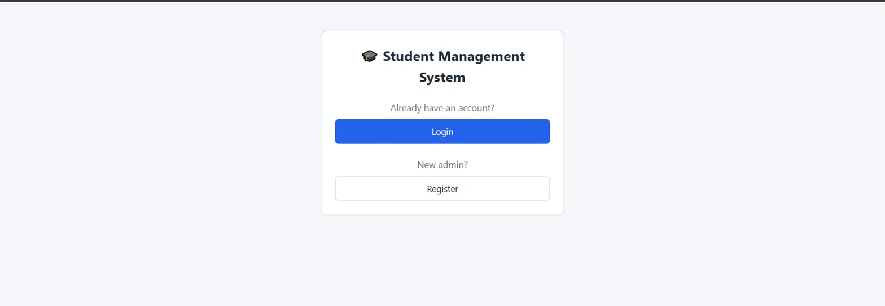
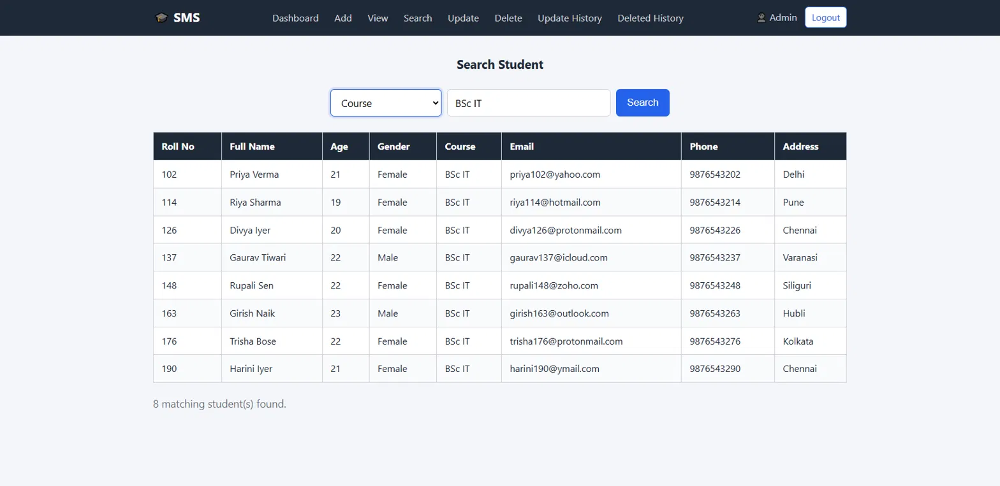
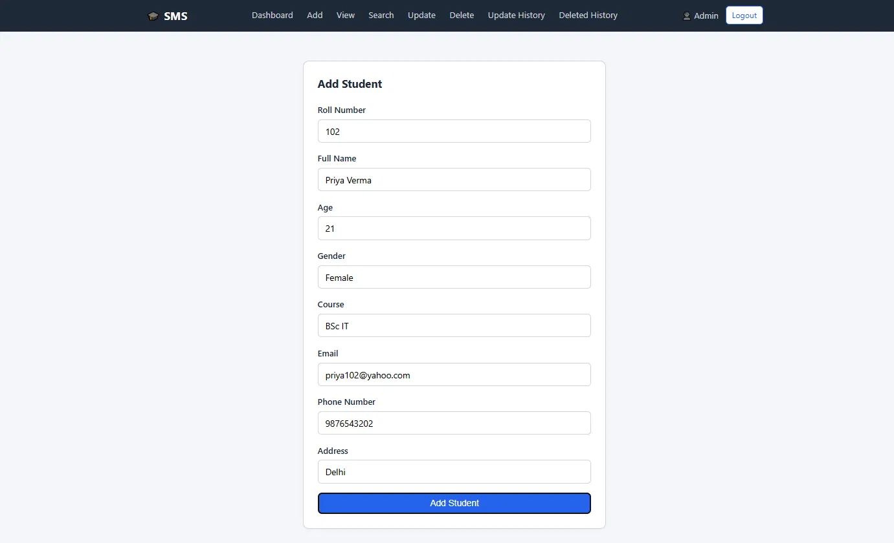
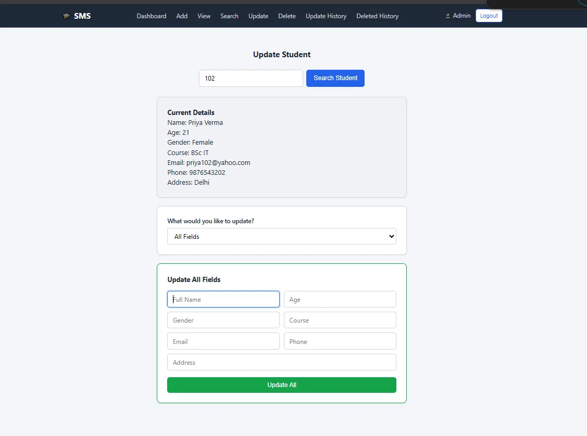
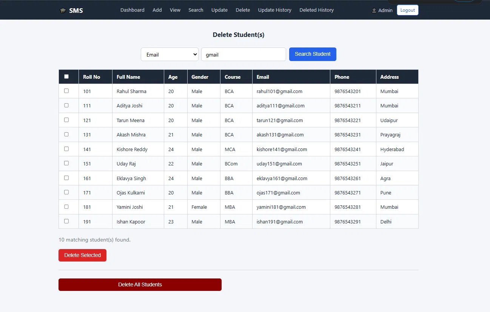
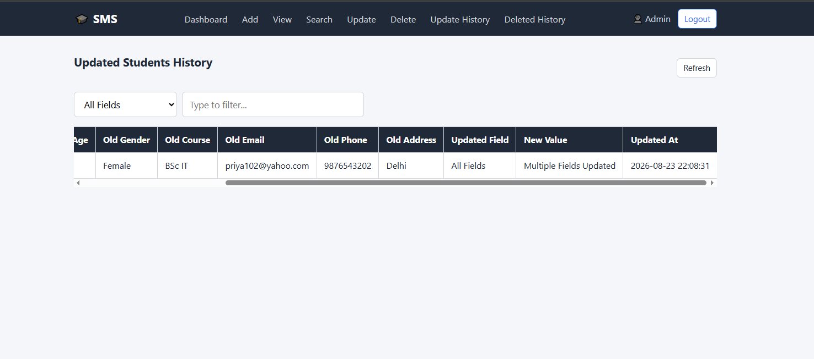
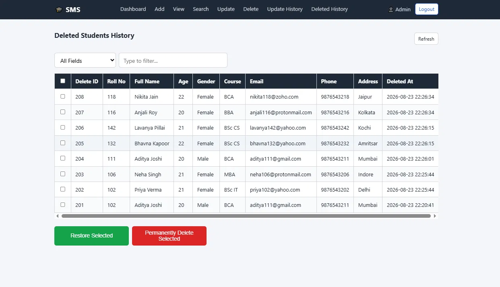

# 🎓 Student Management System (Flask Web App)

This Student Management System has gone through two stages as I've learned — all living in the **same GitHub repository**, with each stage marked by a git tag rather than split into separate repos:

| Stage | Interface | Tag |
|---|---|---|
| 1 | **Console-based** (plain terminal I/O) | [`console-v1`](https://github.com/gaurav-vishwakarma-codes/student-management-system/tree/console-v1) |
| 2 | **Tkinter GUI** (desktop windows) | [`gui-v2`](https://github.com/gaurav-vishwakarma-codes/student-management-system/tree/gui-v2) |

Each stage rebuilds the same core idea with a different interface and architecture. This version's step: same core logic and database design as the Tkinter (`gui-v2`) stage, rebuilt as a proper browser-based web application — Tkinter windows became Flask routes + Jinja2 templates, and the desktop event loop became a real HTTP request/response cycle.

Admins can register, log in, and perform full CRUD operations on student records, with update history, soft-delete, permanent-delete, and restore support — now accessible from any browser instead of a single desktop window.

---

## 📸 Screenshots

**Start Page**



**Admin Login**


**Dashboard**


**View Students**


**Search Student**



**Add Student**



**Update Student**



**Delete Student(s)**



**Updated Students History**



**Deleted Students History**



---

## ✨ Features

- Admin Registration & Login (passwords hashed with SHA-256, never stored in plain text)
- Add Student Records
- View All Student Records in a searchable, filterable table
- Search Students by Roll Number, Full Name, Age, Gender, Course, Email, Phone, or Address — with field-aware validation (e.g. Age must be 5–50, Gender must be a real value, no special characters in Name)
- Update One or All Student Fields at once
- Delete a single student, multiple students matching a search, or all students at once — all soft-deletes (nothing is lost permanently unless explicitly chosen)
- Deleted Students History — restore individually or in bulk, or permanently delete (irreversible) records you no longer need
- Updated Students History — full before/after log of every field change, with timestamps
- Live, field-scoped table filtering on History and View Students pages (no page reload)
- Duplicate Roll Number & Email detection
- Dummy Data Loader (100 sample students across 10 different email domains, for quick testing — skips any that already exist instead of failing outright)
- No external CSS/JS frameworks — all styling and interactivity is hand-written

---

## Technologies Used

- **Python 3**
- **Flask** — web framework
- **SQLite3** — database (file-based, no server setup needed)
- **Jinja2** — server-side HTML templating (ships with Flask)
- Plain HTML/CSS/JavaScript for the frontend — no Bootstrap, jQuery, or any other external library

---

## Requirements

- Python 3.10 or higher
- SQLite3 (bundled with Python — no install needed)
- Flask (see `requirements.txt`)

No other external dependencies — everything besides Flask itself comes from Python's standard library (`sqlite3`, `hashlib`, `re`).

---

## Project Structure

```
SMS-Flask-Based/
│
├── app/
│   ├── __init__.py                # Flask app factory, blueprint registration, no-cache headers
│   ├── config.py                  # DB_NAME, SECRET_KEY
│   │
│   ├── database/
│   │   ├── __init__.py
│   │   ├── db_connection.py       # get_connection / close_connection
│   │   ├── db_creation.py         # CREATE TABLE statements
│   │   └── dummy_data.py          # 100 sample student records (mixed email domains)
│   │
│   ├── services/                  # business logic + DB queries (renamed from utils/)
│   │   ├── __init__.py
│   │   ├── validations.py         # all input + search validation rules
│   │   ├── password_helper.py     # hash_password / verify_password
│   │   ├── update_helper.py       # store_update_history / is_same_value
│   │   ├── student_service.py     # add / view / search / delete / bulk-delete
│   │   ├── update_student_actions.py  # per-field + "update all" logic
│   │   └── history_service.py     # update/deleted history + restore + permanent delete
│   │
│   ├── routes/                    # Flask blueprints (replaces gui/ windows)
│   │   ├── __init__.py
│   │   ├── auth_routes.py         # login, register, logout, login_required decorator
│   │   ├── student_routes.py      # dashboard, add, view, search, update, delete
│   │   └── history_routes.py      # updated/deleted history views + restore/permanent-delete
│   │
│   ├── templates/                 # Jinja2 HTML (replaces Tkinter windows)
│   │   ├── base.html              # shared layout, nav bar, flash messages
│   │   ├── start.html / login.html / register.html / dashboard.html
│   │   ├── add_student.html / view_students.html / search_student.html
│   │   ├── update_student.html / delete_student.html
│   │   └── updated_history.html / deleted_history.html
│   │
│   └── static/
│       ├── css/style.css          # hand-written, no framework
│       └── js/script.js           # hand-written, no framework
│
├── main.py                        # entry point: create_app(), app.run()
├── screenshots/                   # README screenshots
├── student.db                     # auto-created on first run (gitignored)
├── requirements.txt
├── .gitignore
└── README.md
```

---

## How To Run

### 1. Clone the Repository

This Flask version lives on the `main` branch of the same repo as the Console and Tkinter versions (see the version table above). Cloning normally gets you the latest code — which, once this version is pushed, will be the Flask app:

```bash
git clone https://github.com/gaurav-vishwakarma-codes/student-management-system.git
cd student-management-system
```

If you specifically want *this* Flask version later (after other changes have been pushed on top of it), check out its tag instead:

```bash
git checkout flask-v3
```

### 2. Create and Activate a Virtual Environment

```bash
python -m venv venv
venv\Scripts\activate        # Windows
source venv/bin/activate     # Mac/Linux
```

### 3. Install Dependencies

```bash
pip install -r requirements.txt
```

### 4. Run the Application

```bash
python main.py
```

On first run this automatically creates all database tables, then starts the Flask dev server. Open your browser to:

```
http://127.0.0.1:5000
```

---

## First-Time Setup Inside the App

1. Click **Register** to create an admin account.
2. Log in with your credentials.
3. On the Dashboard, click **Load Dummy Data** to insert 100 sample student records (safe to click again later — it only inserts records that don't already exist).

---

## Database Tables

| Table              | Purpose                                              |
|--------------------|-------------------------------------------------------|
| `admins`           | Admin credentials (username + SHA-256 password hash) |
| `students`         | Active student records                               |
| `updated_students` | Full snapshot before each update + changed field     |
| `deleted_students` | Soft-deleted records available for restoration       |

---

## Validation Rules

| Field       | Rules                                                        |
|-------------|---------------------------------------------------------------|
| Roll Number | Digits only, greater than 0                                  |
| Full Name   | Letters and spaces only, min 2 words, each word min 3 chars  |
| Age         | Digits only, between 5 and 50                                |
| Gender      | Must be Male, Female, or Other                               |
| Course      | Letters/spaces/dots only, min 2 chars                        |
| Email       | Must match standard email format                             |
| Phone       | Exactly 10 digits                                             |
| Address     | Min 2 chars, cannot be digits only                            |
| Username    | Letters/digits/underscore, min 3 chars, not digits-only       |
| Password    | Min 8 chars, must have a letter, digit, and special char      |

Search fields follow lighter, format-aware rules (e.g. partial matches are allowed, but Age search must still be numeric and within 5–50, Gender search must resolve to a real gender value, and so on) — see `app/services/validations.py`.

---

## Author

**CodeLearner**

BCA Student | Python, Flask, SQLite & Tkinter Developer

---

## License

Created for learning and educational purposes.
