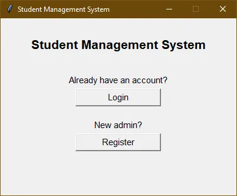
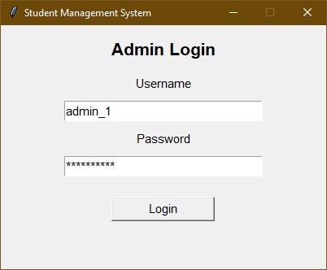
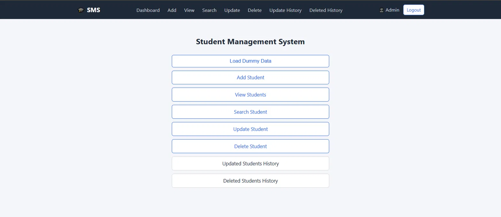
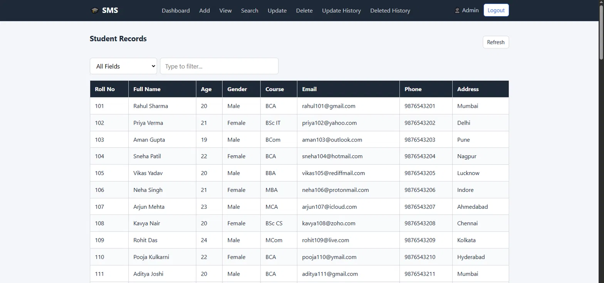

# 🎓 Student Management System (GUI)
 
A desktop Student Management System built with **Python**, **Tkinter**, and **SQLite**.
This is a **GUI-based upgrade** of my earlier [console-based Student Management System](https://github.com/gaurav-vishwakarma-codes/student-management-system/tree/console-v1) — same core logic, now with a proper interface, better structure, and safer data handling.
 
Admins can register, log in, and perform full CRUD operations on student records, with update history, soft-delete, and restore support.

---

## 📸 Screenshots
 
**Start Window**

 
**Admin Login**

 
**Dashboard**

 
**View Students**


---

## ✨ Features

- Admin Registration & Login (passwords hashed with SHA-256, never stored in plain text)
- Add Student Records
- View All Student Records in a table
- Search Student by Roll Number
- Update Individual or All Student Fields at once
- Soft Delete Student Records (restorable, nothing is lost permanently)
- Delete All Students at once
- Restore Deleted Students (single or multi-select)
- View Update History (old value → new value, with timestamp)
- View Deletion History
- Input validation on every field (name, email, phone, age, etc.)
- Duplicate Roll Number & Email detection
- Dummy Data Loader (100 sample students, for quick testing)

---

## Technologies Used

- **Python 3**
- **Tkinter** — GUI
- **SQLite3** — database (file-based, no server setup needed)

---

## Requirements

- Python 3.10 or higher
- SQLite3 (bundled with Python — no install needed)
- Tkinter (bundled with Python on Windows/macOS; on Linux: `sudo apt install python3-tk`)

No external dependencies — this project uses only Python's standard library (`tkinter`, `sqlite3`, `hashlib`, `re`). No `requirements.txt` needed.

---

## Project Structure

```
SMS/
│
├── database/
│   ├── __init__.py
│   ├── db_connection.py           # get_connection / close_connection
│   ├── db_creation.py             # CREATE TABLE statements
│   └── dummy_data.py              # 100 sample student records
│
├── gui/
│   ├── __init__.py
│   ├── start_window.py            # First screen: Login / Register choice
│   ├── login_window.py            # Admin login form
│   ├── register_window.py         # Admin registration form
│   ├── dashboard.py               # Main menu after login
│   ├── add_student_window.py      # Add Student form
│   ├── view_students_window.py    # Table of all active students
│   ├── search_student_window.py   # Search by Roll Number
│   ├── update_student_window.py   # Update one or all student fields
│   ├── delete_student_window.py   # Soft delete one / all students
│   ├── view_updated_history_window.py  # Update history table
│   └── view_deleted_history_window.py  # Deletion history + restore (single/multi-select)
│
├── utils/
│   ├── __init__.py
│   ├── validations.py             # All input validation functions
│   ├── password_helper.py         # hash_password / verify_password
│   ├── update_helper.py           # store_update_history / is_same_value
│   ├── student_service.py         # Add / view / search / delete DB logic
│   ├── update_student_actions.py  # Per-field + "update all" DB logic
│   └── history_service.py         # Update/deleted history fetch + restore logic
│
├── config.py                      # DB_NAME constant (must stay at root)
├── main.py                        # Entry point
├── student.db                     # Auto-created on first run (gitignored)
├── .gitignore
└── README.md
```

---

## How To Run

### 1. Clone the Repository

```bash
git clone <repository-link>
cd SMS
```

### 2. Run the Application

```bash
python main.py
```

On first run this will automatically create all database tables, then open the GUI.

---

## First-Time Setup Inside the App

1. Click **Register** to create an admin account.
2. Log in with your credentials.
3. On the Dashboard, click **Load Dummy Data** to insert 100 sample student records (only works once — skipped if data already exists).

---

## Database Tables

| Table              | Purpose                                              |
|--------------------|------------------------------------------------------|
| `admins`           | Admin credentials (username + SHA-256 password hash) |
| `students`         | Active student records                               |
| `updated_students` | Full snapshot before each update + changed field     |
| `deleted_students` | Soft-deleted records available for restoration       |

---

## Validation Rules

| Field       | Rules                                                        |
|-------------|--------------------------------------------------------------|
| Roll Number | Digits only, greater than 0                                  |
| Full Name   | Letters and spaces only, min 2 words, each word min 3 chars  |
| Age         | Digits only, between 5 and 50                                |
| Gender      | Must be Male, Female, or Other                               |
| Course      | Letters/spaces/dots only, min 2 chars                        |
| Email       | Must match standard email format                             |
| Phone       | Exactly 10 digits                                            |
| Address     | Min 2 chars, cannot be digits only                           |
| Username    | Letters/digits/underscore, min 3 chars, not digits-only      |
| Password    | Min 8 chars, must have a letter, digit, and special char     |

---

## Author

**CodeLearner**
BCA Student | Python, SQLite & Tkinter Developer

---

## License

Created for learning and educational purposes.
